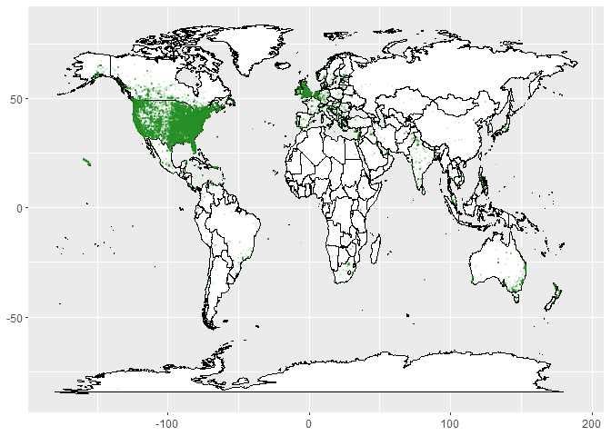
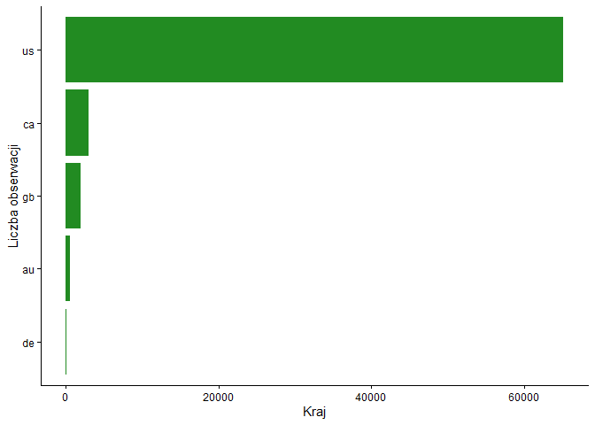
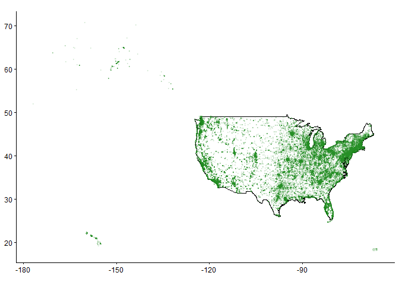
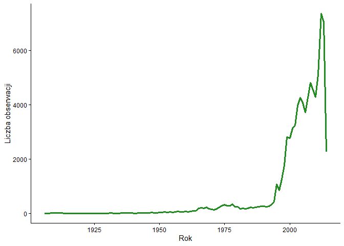
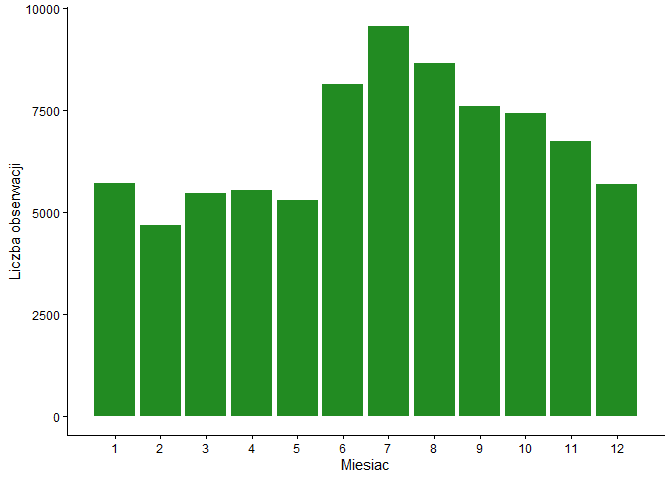
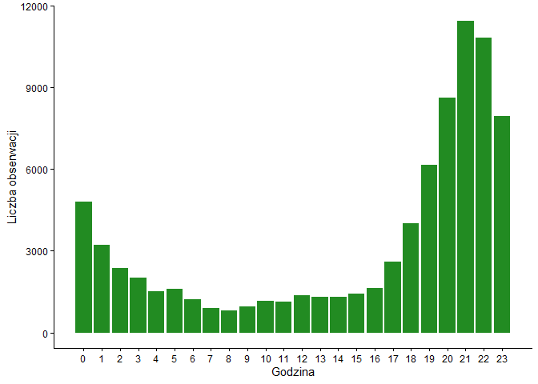
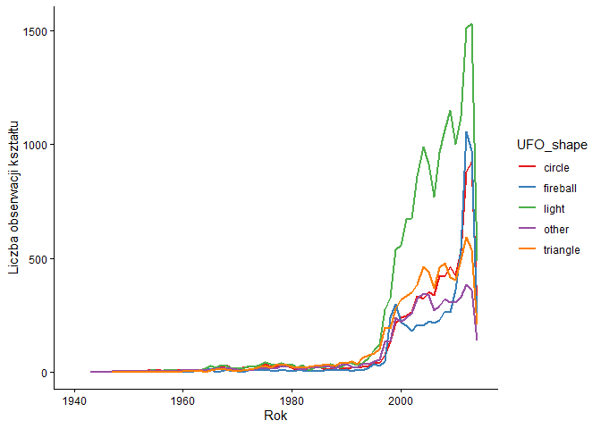

Analiza występowania UFO
================
Nikodem Kijas
2026-01-15

``` r
library(tidyverse)
library(patchwork)
library(knitr)
```

# Wstęp do analizy

## UFO jest tematem ciekawiącym ludzi już od wielu lat. Pojawia się ono w teoriach spiskowych i popkulturze. W niniejszym projekcie koncentruje się na poszukiwaniu wzorców i zależności. Sprawdzimy, czy rozmieszczenie geograficzne zgłoszeń jest przypadkowe, oraz czy aktywność obserwatorów wykazuje cykliczność powiązaną z porami roku lub dniami tygodnia, a także jak zmieniały się obserwowane kształty na niebie.

## Wczytanie danych

``` r
data <- read.csv("ufo_sighting_data.csv") %>% 
  mutate(
         Date_time = mdy_hm(Date_time), 
         date_documented = mdy(date_documented),
         documantation_delay = round(difftime(date_documented, as.Date(Date_time), units = "days")),
         length_of_encounter_seconds = as.numeric(length_of_encounter_seconds),
         description = gsub("&#44", ",", description),
         description = gsub("&#33", "!", description),
         description = gsub("&#39", "'", description),
         description = gsub("&quot", '"', description),
         latitude = as.numeric(latitude),
         year = year(Date_time), 
         month = month(Date_time),
         weekday = wday(Date_time, label = TRUE, abbr = FALSE, week_start = 1),
         hour = hour(Date_time),
         ) %>% 
  filter(!is.na(latitude) & !is.na(length_of_encounter_seconds))
```

## Podstawowe statystyki

``` r
summary(data)
```

    ##    Date_time                       city           state.province    
    ##  Min.   :1906-11-11 00:00:00   Length:80328       Length:80328      
    ##  1st Qu.:2001-08-02 22:25:00   Class :character   Class :character  
    ##  Median :2006-11-22 05:57:00   Mode  :character   Mode  :character  
    ##  Mean   :2004-05-17 07:31:50                                        
    ##  3rd Qu.:2011-06-21 03:30:00                                        
    ##  Max.   :2014-05-08 18:45:00                                        
    ##                                                                     
    ##    country           UFO_shape         length_of_encounter_seconds
    ##  Length:80328       Length:80328       Min.   :       0           
    ##  Class :character   Class :character   1st Qu.:      30           
    ##  Mode  :character   Mode  :character   Median :     180           
    ##                                        Mean   :    9017           
    ##                                        3rd Qu.:     600           
    ##                                        Max.   :97836000           
    ##                                                                   
    ##  described_duration_of_encounter description        date_documented     
    ##  Length:80328                    Length:80328       Min.   :1998-03-07  
    ##  Class :character                Class :character   1st Qu.:2003-11-26  
    ##  Mode  :character                Mode  :character   Median :2007-11-28  
    ##                                                     Mean   :2007-07-28  
    ##                                                     3rd Qu.:2011-10-10  
    ##                                                     Max.   :2014-05-08  
    ##                                                                         
    ##     latitude        longitude       documantation_delay       year     
    ##  Min.   :-82.86   Min.   :-176.66   Min.   :  -14 days   Min.   :1906  
    ##  1st Qu.: 34.13   1st Qu.:-112.07   1st Qu.:    9 days   1st Qu.:2001  
    ##  Median : 39.41   Median : -87.90   Median :   27 days   Median :2006  
    ##  Mean   : 38.12   Mean   : -86.77   Mean   : 1167 days   Mean   :2004  
    ##  3rd Qu.: 42.79   3rd Qu.: -78.75   3rd Qu.:  120 days   3rd Qu.:2011  
    ##  Max.   : 72.70   Max.   : 178.44   Max.   :35106 days   Max.   :2014  
    ##                                                                        
    ##      month                weekday           hour      
    ##  Min.   : 1.000   poniedziałek:10094   Min.   : 0.00  
    ##  1st Qu.: 4.000   wtorek      :10777   1st Qu.:10.00  
    ##  Median : 7.000   środa       :10962   Median :19.00  
    ##  Mean   : 6.835   czwartek    :11024   Mean   :15.53  
    ##  3rd Qu.: 9.000   piątek      :11619   3rd Qu.:21.00  
    ##  Max.   :12.000   sobota      :14062   Max.   :23.00  
    ##                   niedziela   :11790

``` r
glimpse(data)
```

    ## Rows: 80,328
    ## Columns: 16
    ## $ Date_time                       <dttm> 1949-10-10 20:30:00, 1949-10-10 21:00…
    ## $ city                            <chr> "san marcos", "lackland afb", "chester…
    ## $ state.province                  <chr> "tx", "tx", "", "tx", "hi", "tn", "", …
    ## $ country                         <chr> "us", "", "gb", "us", "us", "us", "gb"…
    ## $ UFO_shape                       <chr> "cylinder", "light", "circle", "circle…
    ## $ length_of_encounter_seconds     <dbl> 2700, 7200, 20, 20, 900, 300, 180, 120…
    ## $ described_duration_of_encounter <chr> "45 minutes", "1-2 hrs", "20 seconds",…
    ## $ description                     <chr> "This event took place in early fall a…
    ## $ date_documented                 <date> 2004-04-27, 2005-12-16, 2008-01-21, 2…
    ## $ latitude                        <dbl> 29.88306, 29.38421, 53.20000, 28.97833…
    ## $ longitude                       <dbl> -97.941111, -98.581082, -2.916667, -96…
    ## $ documantation_delay             <drtn> 19923 days, 20521 days, 19096 days, 1…
    ## $ year                            <dbl> 1949, 1949, 1955, 1956, 1960, 1961, 19…
    ## $ month                           <dbl> 10, 10, 10, 10, 10, 10, 10, 10, 10, 10…
    ## $ weekday                         <ord> poniedziałek, poniedziałek, poniedział…
    ## $ hour                            <int> 20, 21, 17, 21, 20, 19, 21, 23, 20, 21…

``` r
head(data)
```

    ##             Date_time                 city state.province country UFO_shape
    ## 1 1949-10-10 20:30:00           san marcos             tx      us  cylinder
    ## 2 1949-10-10 21:00:00         lackland afb             tx             light
    ## 3 1955-10-10 17:00:00 chester (uk/england)                     gb    circle
    ## 4 1956-10-10 21:00:00                 edna             tx      us    circle
    ## 5 1960-10-10 20:00:00              kaneohe             hi      us     light
    ## 6 1961-10-10 19:00:00              bristol             tn      us    sphere
    ##   length_of_encounter_seconds described_duration_of_encounter
    ## 1                        2700                      45 minutes
    ## 2                        7200                         1-2 hrs
    ## 3                          20                      20 seconds
    ## 4                          20                        1/2 hour
    ## 5                         900                      15 minutes
    ## 6                         300                       5 minutes
    ##                                                                                                                                 description
    ## 1   This event took place in early fall around 1949-50. It occurred after a Boy Scout meeting in the Baptist Church. The Baptist Church sit
    ## 2                                              1949 Lackland AFB, TX.  Lights racing across the sky &amp; making 90 degree turns on a dime.
    ## 3                                                                                          Green/Orange circular disc over Chester, England
    ## 4   My older brother and twin sister were leaving the only Edna theater at about 9 PM,...we had our bikes and I took a different route home
    ## 5 AS a Marine 1st Lt. flying an FJ4B fighter/attack aircraft on a solo night exercise, I was at 50,000' in a ";clean"; aircraft (no ordinan
    ## 6   My father is now 89 my brother 52 the girl with us now 51 myself 49 and the other fellow which worked with my father if he's still livi
    ##   date_documented latitude   longitude documantation_delay year month
    ## 1      2004-04-27 29.88306  -97.941111          19923 days 1949    10
    ## 2      2005-12-16 29.38421  -98.581082          20521 days 1949    10
    ## 3      2008-01-21 53.20000   -2.916667          19096 days 1955    10
    ## 4      2004-01-17 28.97833  -96.645833          17265 days 1956    10
    ## 5      2004-01-22 21.41806 -157.803611          15809 days 1960    10
    ## 6      2007-04-27 36.59500  -82.188889          16635 days 1961    10
    ##        weekday hour
    ## 1 poniedziałek   20
    ## 2 poniedziałek   21
    ## 3 poniedziałek   17
    ## 4        środa   21
    ## 5 poniedziałek   20
    ## 6       wtorek   19

``` r
tail(data)
```

    ##                 Date_time      city state.province country UFO_shape
    ## 80323 2013-09-09 21:00:00 woodstock             ga      us    sphere
    ## 80324 2013-09-09 21:15:00 nashville             tn      us     light
    ## 80325 2013-09-09 22:00:00     boise             id      us    circle
    ## 80326 2013-09-09 22:00:00      napa             ca      us     other
    ## 80327 2013-09-09 22:20:00    vienna             va      us    circle
    ## 80328 2013-09-09 23:00:00    edmond             ok      us     cigar
    ##       length_of_encounter_seconds described_duration_of_encounter
    ## 80323                          20                      20 seconds
    ## 80324                         600                      10 minutes
    ## 80325                        1200                      20 minutes
    ## 80326                        1200                            hour
    ## 80327                           5                       5 seconds
    ## 80328                        1020                      17 minutes
    ##                                                                                                           description
    ## 80323 Driving 575 at 21:00 hrs saw a white and green bright sphere.Moved really fast up and down then it disappeared.
    ## 80324                                                    Round from the distance/slowly changing colors and hovering.
    ## 80325                                          Boise, ID, spherical, 20 min, 10 red lights, seen by husband and wife.
    ## 80326                                                                                                       Napa UFO,
    ## 80327                                              Saw a five gold lit cicular craft moving fastly from rght to left.
    ## 80328         2 witnesses 2  miles apart, Red &amp; White Elongated-Cigar Shaped Flashing lights, NW of Oklahoma City
    ##       date_documented latitude  longitude documantation_delay year month
    ## 80323      2013-09-30 34.10139  -84.51944             21 days 2013     9
    ## 80324      2013-09-30 36.16583  -86.78444             21 days 2013     9
    ## 80325      2013-09-30 43.61361 -116.20250             21 days 2013     9
    ## 80326      2013-09-30 38.29722 -122.28444             21 days 2013     9
    ## 80327      2013-09-30 38.90111  -77.26556             21 days 2013     9
    ## 80328      2013-09-30 35.65278  -97.47778             21 days 2013     9
    ##            weekday hour
    ## 80323 poniedziałek   21
    ## 80324 poniedziałek   21
    ## 80325 poniedziałek   22
    ## 80326 poniedziałek   22
    ## 80327 poniedziałek   22
    ## 80328 poniedziałek   23

# Analiza miejsc występowania

## Grafika przedstawia wszystkie zgłoszenia o ufo naniesione na mapę

``` r
country_map = map_data("world")
ggplot() +
  geom_map(data = country_map, 
           map = country_map,aes(x = long, y = lat, map_id = region, group = group),
           fill = "white", color = "black", size=0.1)+
            geom_point(data = data, aes(x=longitude, y = latitude), color = "forestgreen", size=0.5, alpha = 0.1 )+
  labs(x=NULL, y=NULL)
```

<!-- -->

### Z powyżej przedstawionej mapy, możemy odczytać że większość obserwacji była zanotowana w Ameryce Północnej i Europie

## Aby potwierdzić to, co odczytaliśy z mapy, sprawdzamy dokładne liczby dla każdego z państw.

``` r
data %>% 
  filter(!country == "") %>% 
  group_by(country) %>% 
  summarize(liczba_obserwacji=n()) %>%
  ggplot(aes(x=reorder(country, liczba_obserwacji), y=liczba_obserwacji))+
  geom_col(fill="forestgreen")+
  coord_flip()+
  theme_classic()+
  labs(x="Liczba obserwacji", y="Kraj")
```

<!-- -->

### Powyższy wykres wskazuje nam że znaczna większość danych pochodzi z USA, niestety wyniki z tego testu mogą nie być do końca rzetelne, ponieważ w wiele rekordów nie posiada kodu kraju.

## Skoro wiemy już, że większość przypadków jest w stanach, to sprawdźmy które stany są najczęściej odwiedzane przez kosmitów.

``` r
usa_map = map_data("usa")

us_data <- data %>% 
  filter(country=="us")

ggplot()+
  geom_map(data = usa_map, 
       map=usa_map, aes(x = long, y = lat, map_id = region, group = group),
       fill = "white", color = "black")+ 
  geom_point(data = us_data, aes(x=longitude, y = latitude), color = "forestgreen", size = 0.5, alpha=0.1)+
  coord_quickmap()+
  theme_classic()+
  labs(x=NULL, y=NULL)
```

<!-- -->

### Z powyższej mapy widzimy, że najwięcej zgłoszeń występuje we wschodniej części kraju i na zachodnim wybrzeżu. Środkowa część kraju jest dużo rzadziej odwiedzana. Wynika z tego, że większa liczba zgłoszeń występuje w obszarach gęściej zaludnionych.

## Poniższa tabela przedstawia dokładne wyniki dla 5 stanów z największą liczbą zgłoszeń

``` r
top_country <- data %>% 
  filter(country == "us") %>% 
  group_by(state.province) %>% 
  mutate(state.province = state.name[match(toupper(state.province), state.abb)])%>%
  summarize(liczba_obserwacji = n()) %>% 
  arrange(desc(liczba_obserwacji))  %>% 
  top_n(5)

kable(top_country,
            col.names = c("Stan", "Liczba zgłoszeń")
)
```

| Stan       | Liczba zgłoszeń |
|:-----------|----------------:|
| California |            8911 |
| Washington |            3966 |
| Florida    |            3835 |
| Texas      |            3447 |
| New York   |            2980 |

### Tabela potwierdziła nam, że najwięcej zgłoszeń pochodzi z najludniejszych stanów, aż 4 z tej 5 znajdują się w 5 najludniejszych stanach. Tylko Washington wypada poza topką.

## Sprawdzimy teraz, w którym mieście najczęściej zgłaszane są owe zjawiska.

``` r
top_cities <- data %>%
  group_by(city, state.province) %>% 
  summarize(liczba_obserwacji = n(), .groups= "drop") %>% 
  mutate(state.province = state.name[match(toupper(state.province), state.abb)])%>%
  arrange(desc(liczba_obserwacji)) %>%
  top_n(5)

kable(top_cities, col.names = c("Miasto", "Stan", "Liczba obserwacji"))
```

| Miasto      | Stan       | Liczba obserwacji |
|:------------|:-----------|------------------:|
| seattle     | Washington |               524 |
| phoenix     | Arizona    |               450 |
| las vegas   | Nevada     |               363 |
| los angeles | California |               352 |
| san diego   | California |               336 |

### Tabela potwierdza poprzednie wnioski, mówiące że liczba zgłoszeń zależy od liczby ludności w danym miejscu. W większych miastach odnotowuje się więcej obserwacji.

# Analiza czasu występowania

## Obserwacje na przestrzeni lat

``` r
data %>% 
  group_by(year) %>% 
  summarize(liczba_obserwacji = n())%>%
  ggplot(aes(x=year, y=liczba_obserwacji))+
  geom_line(color="forestgreen", size=1.2)+
  labs(x="Rok", y="Liczba obserwacji")+
  theme_classic()
```

<!-- -->

### Po przeanalizowaniu powyższego wykresu, możemy zauważyć że liczba zgłoszeń gwałtownie zaczęła rosnąć w latach 90, mimo że pierwszą myślą może być powiązanie tego z kinem sci-fi, jednak nie jest to prawdą iż owe filmy w kinach zaczęły się pojawiać już w latach 50. Jednak na wzrost ten mógł mieć wpływ “E.T.” który zadebiutował w 1982 roku oraz “Z archiwum X” z 1993.

## Sprawdzimy teraz w którym miesiącu zostało najwięćej zgłoszonych przypadków

``` r
ggplot(data, aes(x=month))+
  geom_bar(fill="forestgreen")+
  scale_x_continuous(breaks = c(1:12) )+
  labs(x="Miesiac", y="Liczba obserwacji")+
  theme_classic()
```

<!-- -->

### Największa liczba zgłoszeń przypada w cieplejszych miesiącach, a gdy temperatura zaczyna spadać, to liczba zgłoszeń również maleje. Najprawdopodobniej nie jest spowodowane to upodobaniem kosmitów w wysokich temperaturach, lecz raczej związana jest z tym, że w letnich miesiącach ludzie częściej wieczory spędzają na zewnątrz, co skutkuje większą ilością zgłoszeń

## Następnie sprawdzimy w jaki dzień tygodnia najlepiej wypatrywać kosmitów

``` r
weekday <- data %>% 
  group_by(weekday) %>% 
  summarize(liczba_obserwacji = n())

kable(weekday, col.names=c("Dzień tygodnia", "Liczba obserwacji"))
```

| Dzień tygodnia | Liczba obserwacji |
|:---------------|------------------:|
| poniedziałek   |             10094 |
| wtorek         |             10777 |
| środa          |             10962 |
| czwartek       |             11024 |
| piątek         |             11619 |
| sobota         |             14062 |
| niedziela      |             11790 |

### Najwięcej obserwacji występuję w okolicy weekendu, co nie sugeruje nam że kosmici w tygodniu pracują, lecz potwierdza teorie z poprzedniego wykresu. W dni wolne ludzie mają więcej czasu, żeby wieczory spędzać poza domem. Dodatkowo luźna weekendowa atmosfera ułatwia dostrzeżenie czegoś nietypowego na niebie.

## Która godzina najlepsza jest do obserwacji nieba

``` r
ggplot(data, aes(x=hour))+
  geom_bar(fill="forestgreen")+
  labs(x="Godzina", y="Liczba obserwacji")+
  scale_x_continuous(breaks = 0:23)+
  theme_classic()
```

<!-- -->

### Z wykresu wynika, że najlepszą porą do spotkania kosmitów są godziny nocne, najwięcej obserwacji zanotowano w godzinach 20-23. Szczyt ten przypada na moment gdy sporo ludzi jeszcze nie śpi, a potem wraz z spadkiem liczba ludzi na nogach, maleje ilość zgłoszeń. Całościowo dużo więcej obserwacji zgłaszane jest w porach nocnych, co ma sens bo po zmroku łatwiej dostrzec coś na niebie.

## Jak zmieniały się trendy w kształtach zaobserwowanego UFO

``` r
data2 <- data %>% 
  filter(UFO_shape != "unknown") %>% 
  group_by(UFO_shape) %>% 
  summarize(liczba_obserwacji = n()) %>% 
  arrange(desc(liczba_obserwacji)) %>% 
  top_n(5)

data3 <- data %>% 
  filter(UFO_shape %in% data2$UFO_shape) %>% 
  group_by(year, UFO_shape) %>% 
  summarize(liczba_obserwacji = n()) 

ggplot(data3, aes(x=year, y=liczba_obserwacji, color=UFO_shape))+
  geom_line(size=0.8)+
  scale_x_continuous(limits = c(1940,2014))+
  scale_color_brewer(palette = "Set1")+
  labs(x="Rok", y="Liczba obserwacji kształtu")+
  theme_classic()
```

<!-- -->

### Z wykresu możemy odczytać, że do ogromnego wzrostu ilości obserwacji, żaden kształt nie dominował. W latach 90 liderem został kształt “light” i zdominował konkurencje.

## Sprawdzimy teraz jak długo trwają zwykle obserwacje najpopularniejszych kształtów ufo

``` r
data4 <- data %>% 
  group_by(UFO_shape) %>% 
  summarise(
    srednia = mean(length_of_encounter_seconds),
    mediana = median(length_of_encounter_seconds),
    odchyl = sd(length_of_encounter_seconds),
    min = min(length_of_encounter_seconds),
    max = max(length_of_encounter_seconds),
    liczba_obserwacji = n()
  ) %>% 
  arrange(desc(liczba_obserwacji)) %>%
  top_n(10)

kable(data4)
```

| UFO_shape |   srednia | mediana |      odchyl |  min |      max | liczba_obserwacji |
|:----------|----------:|--------:|------------:|-----:|---------:|------------------:|
| light     | 13170.345 |     180 |  778197.932 | 0.01 | 66276000 |             16565 |
| triangle  |  1664.266 |     180 |   37677.451 | 0.01 |  2631600 |              7865 |
| circle    |  4768.093 |     180 |  168185.563 | 0.05 | 10526400 |              7607 |
| fireball  |  4023.941 |     120 |  161591.132 | 0.01 | 10526400 |              6208 |
| other     | 20634.211 |     180 | 1111484.141 | 0.05 | 82800000 |              5649 |
| unknown   |  5546.723 |     180 |  167952.232 | 0.01 | 10526400 |              5584 |
| sphere    | 21787.298 |     180 | 1339462.694 | 0.01 | 97836000 |              5387 |
| disk      |  1460.432 |     240 |    9970.207 | 0.33 |   259200 |              5213 |
| oval      |  3898.586 |     180 |  110628.997 | 1.00 |  6312000 |              3733 |
| formation |  1254.049 |     180 |   16026.398 | 1.00 |   604800 |              2457 |

### W wynikach widzimy sporą dysproporcje między średnią długością, a medianą. Wartość środkowa wynosi zwykle 3-4 minuty, a średnia bywa od kilku do kilkunastu razy większa. Spowodowane może to być podanymi bardzo dużymi długościami obserwacji w niektórych rekordach, co możemy zobaczyć w kolumnie max. Bardzo małe wartości również występują, co widzimy w kolumnie min. Do tego odchylenie standardowe jest też bardzo duże.

## Przeanalizujemy teraz jak długo zajmuje ludzią zgłoszenie zaobserwowanego UFO

``` r
data5 <- data %>% 
  filter(documantation_delay > 0) %>% 
  summarize(srednia = round(mean(documantation_delay)),
            min = min(documantation_delay),
            max = max(documantation_delay),
            odch = sd(documantation_delay)
            )


kable(data5)
```

| srednia   | min    | max        |   odch |
|:----------|:-------|:-----------|-------:|
| 1173 days | 1 days | 35106 days | 3266.7 |

### Średnia opóźnienie zgłoszenie zaobserwowanego zjawiska wynosi 1173, co może wpływać na rzetelność zgłoszonych danych, pamięć ludzka bywa ulotna i jest możliwość że zgłaszający przez te 3 lata mógł pomylić jakieś szczegóły.

# Podsumowanie

## Przeprowadzona analiza wykazała, że liczba zgłoszeń jest ściśle powiązana z liczbą ludności. Im większe miasto, tym więcej obserwacji, co sugeruje, że to obecność człowieka generuje te dane. Potwierdziła się też nasza teoria dotycząca czasu wolnego: najwięcej UFO pojawia się w wakacje, w weekendy i wieczorami, czyli wtedy, gdy ludzie faktycznie mają czas patrzeć w niebo i spędzają go na zewnątrz.
